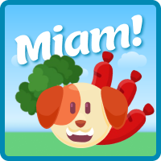

# Jeu-Miam-

Lien du jeu :
https://blankenmeister.github.io/Jeu-Miam-/

**Les règles du jeu:**
Vous étes le chien et vous devez lui donner à manger.
Cliquez sur les différentes nourritures pour remplir sa barre.
Attention il faut varier son alimentation et ne pas remplir sa barre 
à plus de 100 car sinon tu perds.

**Contexte du projet:**
En tant que développeur web JS travaillant pour un petit studio de jeux vidéos, vous devez coder un jeu en JS natif, que vous proposerez ensuite lors de l'IMG (International Meeting of Gamers). Pour cela vous utiliserez JS, l'algorithmie de base, la manipulation du DOM et la POO dans un contexte ludique... mais professionnel ! Vous devrez pour cela le mettre en ligne sur github ou gitlab, et le publier avec netlify (ou autre). Les règles du jeu seront accessibles dans le readme, ainsi que via un bouton dans l'interface de jeu, pour les consulter à tout moment.

**ASPECTS TECHNIQUES OBLIGATOIRES**
Utilisation des objets Javascript d'une manière ou d'une autre (avec une ou deux classes minimum).
Avoir des données dans le JS qui seront modifiées en cours de jeu (barre de vie, score, progression, etc.), l'idée est de travailler la séparation des données et de l'affichage.
Le code est propre, DRY, commenté.

